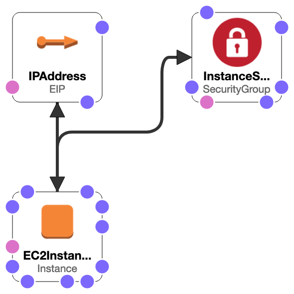

# Ubiquiti Controller Stack

This is a barebones AWS Cloudformation stack template for the Ubiquiti Unifi Cloud Controller. 

It will create the following:
* EC2 t3.nano instance
* 30Gb EBS Volume
* Elastic IP Address
* Instance Security Group with the [following rules](https://help.ui.com/hc/en-us/articles/218506997-UniFi-Ports-Used#)



## Before Creating the Stack
Create an EC2 Key-pair (follow [this guide](https://docs.aws.amazon.com/AWSEC2/latest/UserGuide/ec2-key-pairs.html#prepare-key-pair) if you don't know how to do that) and replace `your-key-pair-name-goes-here` with your key-pair in the [ubiquiti_stack.json](ubiquiti_stack.json)

## Creating Stack
### CLI
Assuming you have your [AWS credentials setup](https://docs.aws.amazon.com/cli/latest/userguide/cli-configure-quickstart.html), you can create the stack via the CLI as follows:
```
aws cloudformation create-stack --stack-name my-controller --template-body file://ubiquiti_stack.json
```

### Console
Navigate to the Cloudformation console with the following URL https://console.aws.amazon.com/cloudformation/, click "Create Stack" and then specify the `ubiquiti_stack.json`

## Afterwards...
This only sets up the hardware needed for the controller, examples of the software setup required can be found here:
* 🐉🐉🐉 - **I have not verified the security of these script personally so use at your own risk**
  * [UniFi Installation Scripts](https://community.ui.com/questions/UniFi-Installation-Scripts-or-UniFi-Easy-Update-Script-or-UniFi-Lets-Encrypt-or-UniFi-Easy-Encrypt-/ccbc7530-dd61-40a7-82ec-22b17f027776)
  
* [Install and Secure UniFi Cloud Controller on Amazon Web Services](https://www.simpliwifi.co.uk/install-and-secure-unifi-cloud-controller-on-amazon-web-services/)